# Lab7web
## Belajar PHP Dasar
PHP adalah singkatan dari PHP Hypertext Prepocessor dan merupakan bahasa pemrograman yang di desain khusus untuk web development atau pengembangan web. PHP memiliki sifat Server-Side karena PHP dijalankan atau di eksekusi dari sisi server. maksud di jalankan dari sisi server adalah PHP di jalankan pada komputer server dan bukan pada komputer client. PHP di jalankan melalui aplikasi web browser sama halnya seperti HTML. Hampir semua situs-situs besar dan populer di kembangkan menggunakan PHP. seperti misalnya wordpress, joomla, facebook, twitter, wikipedia dan situs besar lainnya.

### Install PHP
Unduh XAMPP dari https://www.apachefriends.org/download.html dan pilih versi portable untuk memudahkan proses installasi. Kemudian extract file tersebut, seusikan direktorinya (misal: c:\xampp)
### Konfigurasi PHP
Menjalankan Web Server
Untuk menjalankan web server dari menu XAMPP Control.
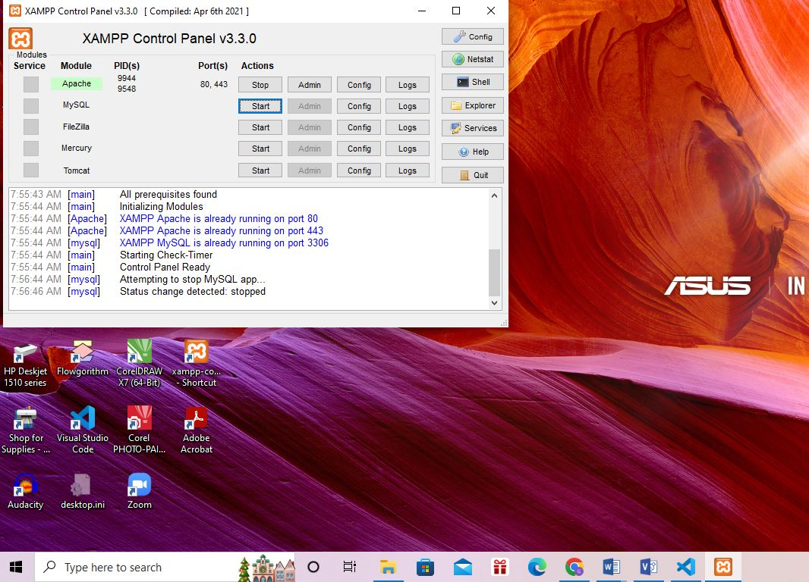
• Uji coba apakah server sudah berkerja dengan baik  
http://127.0.0.1 atau http://localhost
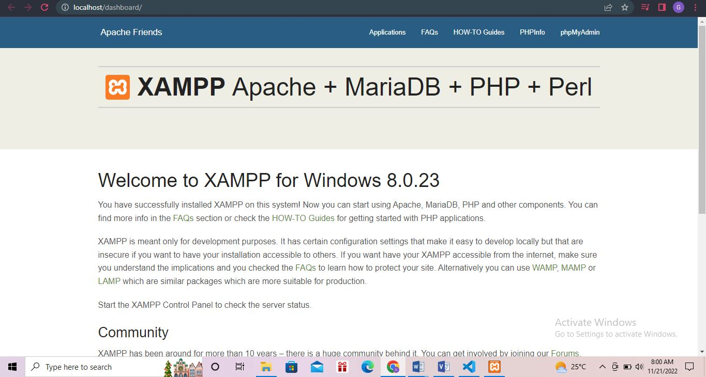
Tampil halaman utama XAMPP jika server sudah berkerja dengan baik. 
• Dokumen Website 
Semua file website tempatkan di direktori: \xampp\htdocs\

### Memulai PHP
Memulai PHP
Buat folder lab7_php_dasar pada root directory web server (d:\xampp\htdocs)
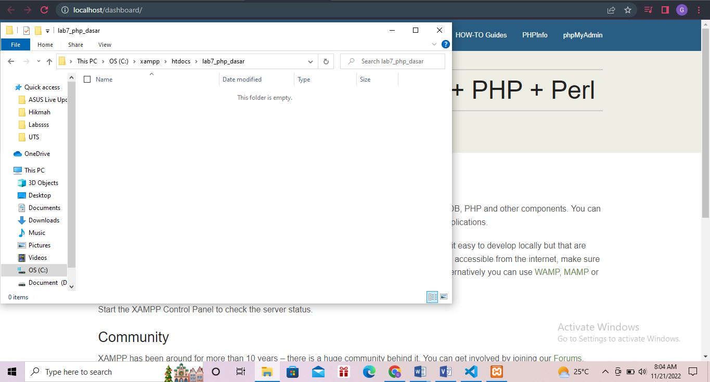
Kemudian untuk mengakses direktory tersebut pada web server dengan mengakses URL: http://localhost/lab7_php_dasar/
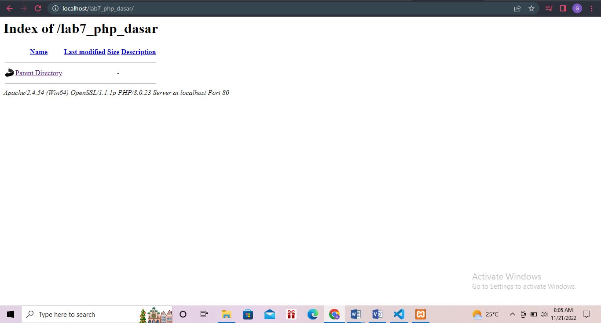
### PHP Dasar
Buat file baru dengan nama php_dasar.php pada directory tersebut. Kemudian buat kode seperti berikut.
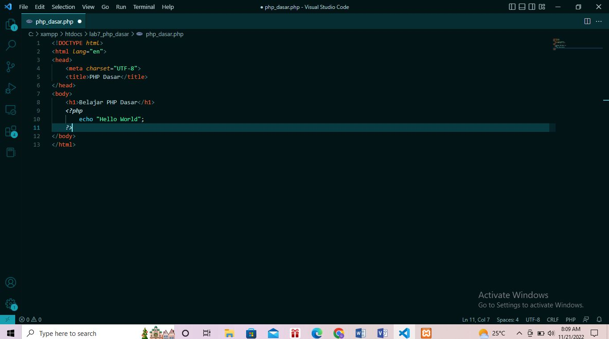
Kemudian untuk mengakses hasilnya melalui URL: http://localhost/lab7_php_dasar/php_dasar.php
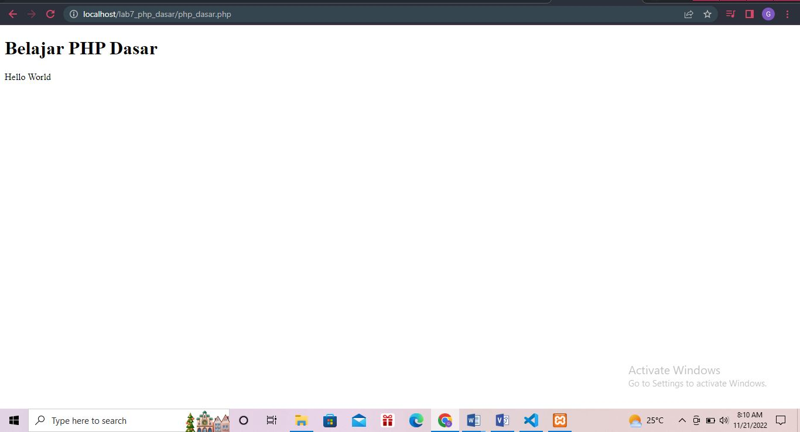
### Variable PHP
Menambahkan variable pada program.
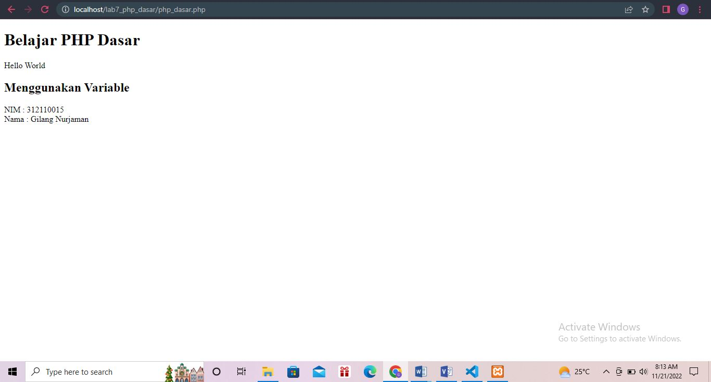
### Predefine Variable $_GET
Kemudian untuk mengakses hasilnya melalui URL: http://localhost/lab7_php_dasar/predefine_variable.php?nama=Gilang%20Nurjaman
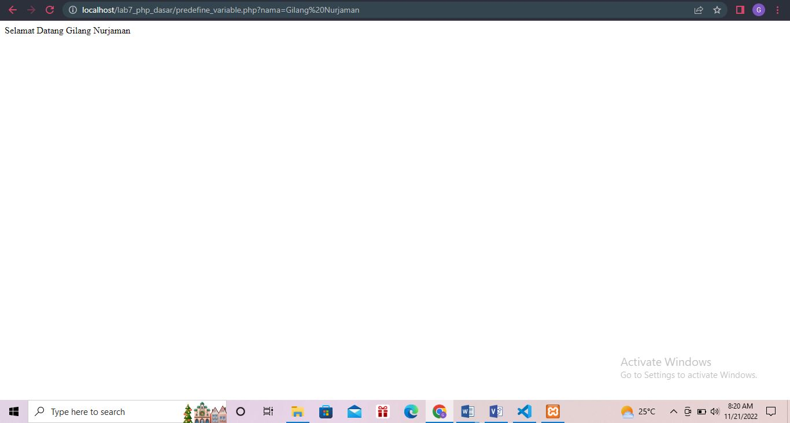
### Membuat Form Input
Kemudian untuk mengakses hasilnya melalui URL: http://localhost/lab7_php_dasar/form_input.php
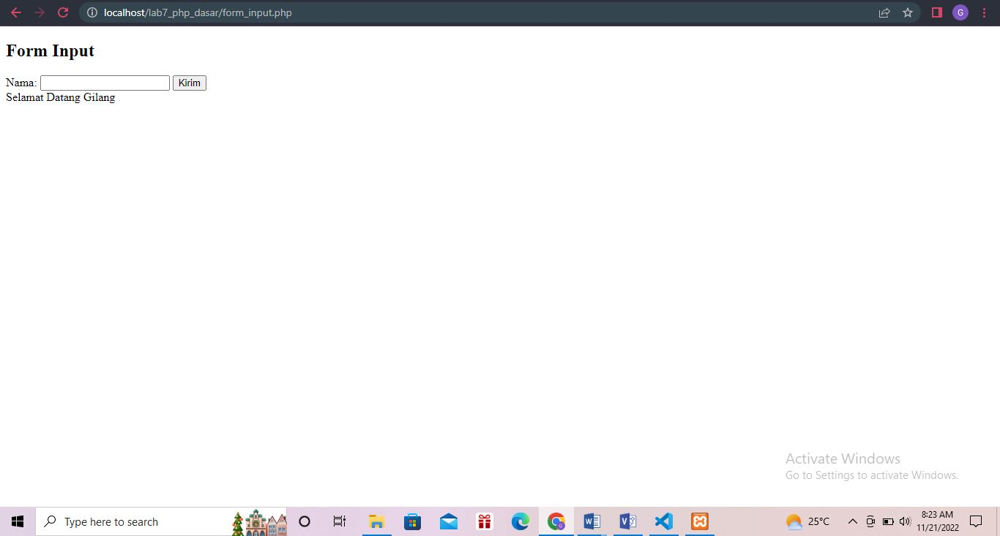
### Operator
Kemudian untuk mengakses hasilnya melalui URL: http://localhost/lab7_php_dasar/operator.php
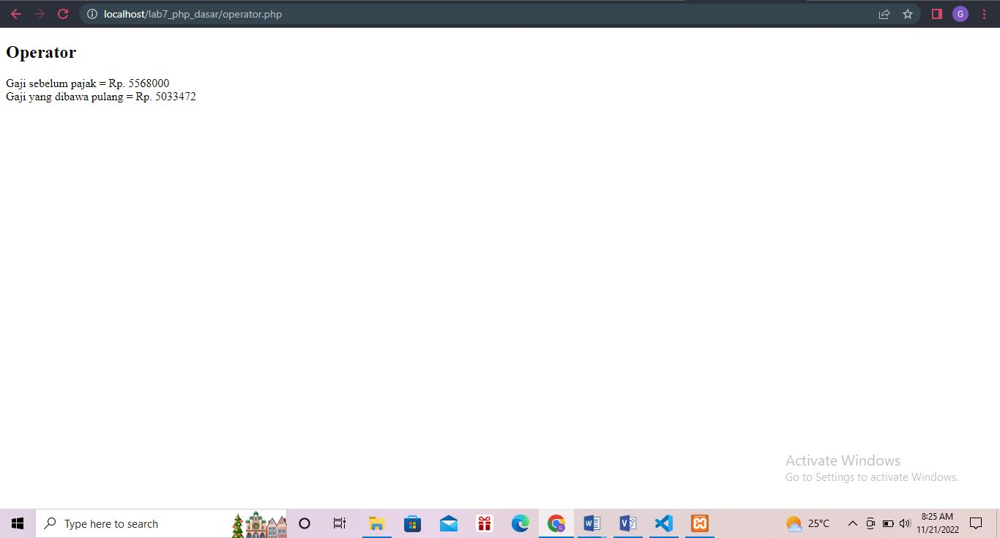
### Kondisi If
Kemudian untuk mengakses hasilnya melalui URL: http://localhost/lab7_php_dasar/kondisi_if.php
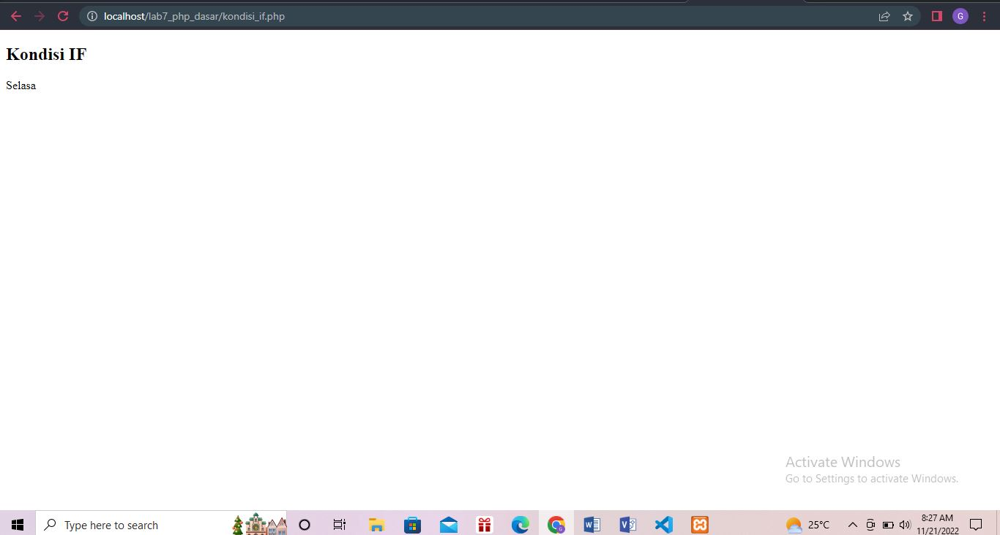
### Kondisi Switch
Kemudian untuk mengakses hasilnya melalui URL: http://localhost/lab7_php_dasar/kondisi_switch.php
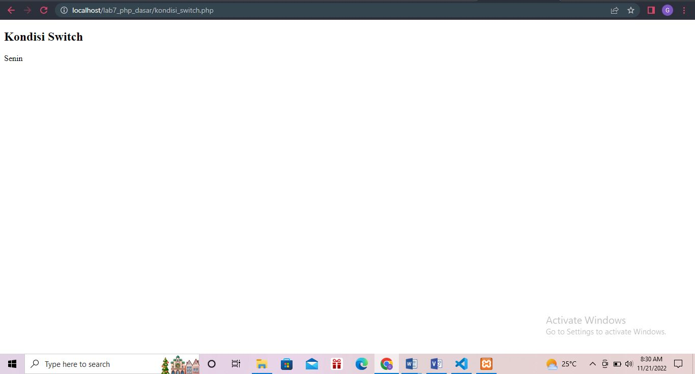
### Perulangan For
Kemudian untuk mengakses hasilnya melalui URL:http://localhost/lab7_php_dasar/perulangan_for.php

### Perulangan While
Kemudian untuk mengakses hasilnya melalui URL: http://localhost/lab7_php_dasar/perulangan_while.php
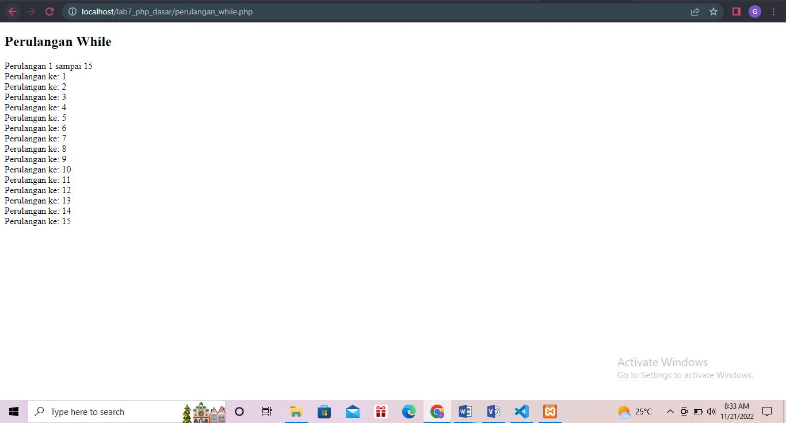
### Perulangan Dowhile
Kemudian untuk mengakses hasilnya melalui URL: http://localhost/lab7_php_dasar/perulangan_dowhile.php
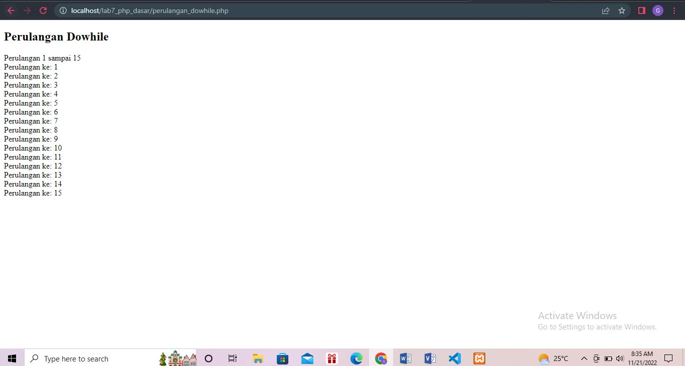

## Gilang Nurjaman